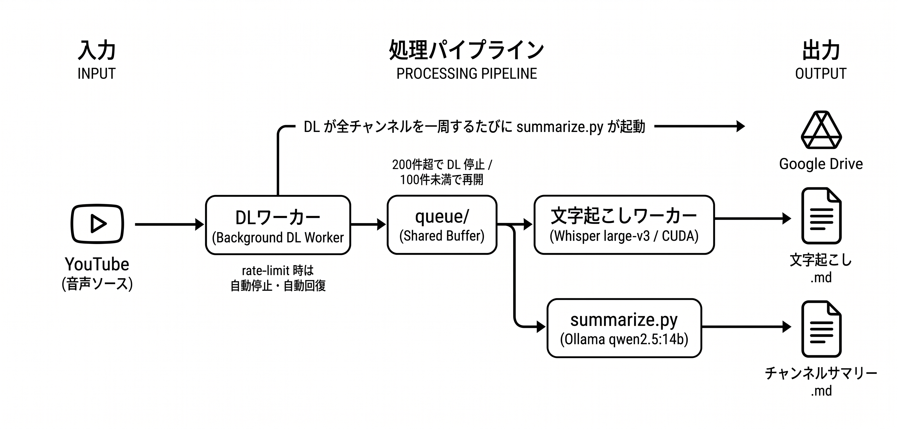

# yt-learn

YouTubeチャンネルの動画を自動文字起こしし、Geminiでサマリーを蓄積するツール。

## ディレクトリ構造

```
yt-learn/
├── autonomous.sh        # ★ 常時稼働エントリポイント（DL/文字起こし並列・rate-limit自動回復）
├── transcribe.py        # 文字起こしコアエンジン
├── summarize.py         # AI要約スクリプト
├── channels.txt         # 追跡するチャンネルのリスト
├── docs/
│   ├── architecture.png # アーキテクチャ図
│   └── DESIGN.md        # 設計メモ・WSL引き継ぎドキュメント
├── .env                 # 環境変数（GEMINI_API_KEY など）※ git管理外
├── cookies.txt          # YouTube クッキー（yt-dlp が書き出し）※ git管理外
├── cache/               # 再生数キャッシュ（チャンネル別）
├── queue/               # DL済み音声の一時置き場（autonomous.sh 用）※ git管理外
├── logs/autonomous/     # autonomous.sh のセッションログ ※ git管理外
├── transcripts/         # チャンネル別の文字起こしファイル ※ git管理外
│   └── {チャンネル名}/
│       ├── _index.json      # 処理済み動画のインデックス（git管理・Mac↔WSL重複排除に使用）
│       ├── _ranking.json    # 人気順ランキング（--sort popular 時に生成）
│       └── {動画タイトル}.md
└── summaries/           # チャンネル別サマリー ※ git管理外
    ├── {チャンネル名}.md
    └── {チャンネル名}_processed.json
```

## セットアップ

```bash
# .env を作成してAPIキーを設定
echo "GEMINI_API_KEY=your_key_here" > .env

# ローカルLLM（Ollama）を使う場合は追加で設定
# Mac: TailscaleでWindowsのOllamaに直接接続
echo "LOCAL_LLM_URL=http://<Windows-TailscaleIP>:11434" >> .env
# WSL: localhostでWindowsのOllamaに接続
echo "LOCAL_LLM_URL=http://localhost:11434" >> .env
echo "LOCAL_LLM_MODEL=qwen3.5:9b" >> .env
```

### ローカルLLM（Ollama）の利用

Gemini APIのレート制限を回避するため、Windows上のOllamaをローカルLLMとして使える。`LOCAL_LLM_URL` が設定されていればOllama優先、失敗時はGeminiにフォールバックする。

**Macから実行する場合**

WindowsのOllamaをTailscale経由で直接参照する。SSHトンネル不要。

```bash
# .env
LOCAL_LLM_URL=http://<Windows-TailscaleIP>:11434
```

**WSLから実行する場合**

WindowsのOllamaにlocalhost経由で接続できる。トンネル不要。

```bash
# .env
LOCAL_LLM_URL=http://localhost:11434
```

### 処理フロー

| | Mac | WSL |
|---|---|---|
| **文字起こし** | whisper.cpp（Metal GPU） | faster-whisper（CUDA） |
| **要約** | Ollama → Gemini フォールバック | Ollama → Gemini フォールバック |

```
URL入力
  └─ yt-dlp でダウンロード（m4a）
       └─ 文字起こし
            ├─ Mac:  whisper.cpp (whisper-cli / Metal)
            └─ WSL:  faster-whisper (CUDA / CPU)
       └─ .md として保存
       └─ ポイント生成
            ├─ Ollama（LOCAL_LLM_URLが設定済みの場合）
            └─ Gemini（Ollama失敗 or 未設定）
```

### Google Drive 同期（rclone）

`transcripts/` と `summaries/` を Google Drive に同期するために rclone を使う。

```bash
# Mac
brew install rclone

# WSL
sudo apt install rclone
```

初回のみ Google Drive のリモートを設定する：

```bash
rclone config
```

対話形式で以下のように進める：

```
n) New remote → n
name> gdrive
Storage> Google Drive の番号を入力
client_id>            （空のままEnter）
client_secret>        （空のままEnter）
scope> 1              （Full access all files）
root_folder_id>       （空のままEnter）
service_account_file> （空のままEnter）
Edit advanced config? → n
Use auto config? → y  （Mac: ブラウザが開く / WSL: n を選んで表示されたURLをMacで開く）
Configure as Shared Drive? → n
y) Yes this is OK → y
```

接続確認：

```bash
rclone lsd gdrive:
# マイドライブ直下のフォルダ一覧が表示されればOK
```

### 使い方

同期先は Google Drive マイドライブ直下の `yt-learn/` フォルダ。

```bash
# transcripts/ と summaries/ を両方同期
python transcribe.py sync

# transcripts/ だけ同期
python transcribe.py sync --only transcripts

# summaries/ だけ同期
python transcribe.py sync --only summaries
```

Mac・WSL どちらから実行しても同じ Drive フォルダに集約される。

## 使い方

### チャンネル管理

```bash
# チャンネル追加（言語省略時は ja）
python transcribe.py add "メンタリスト DaiGo" https://www.youtube.com/@mentalistdaigo
python transcribe.py add 3Blue1Brown https://www.youtube.com/@3blue1brown en

# チャンネル削除
python transcribe.py remove "メンタリスト DaiGo"

# 登録チャンネル一覧
python transcribe.py list
```

`add` / `remove` はいずれも実行後に channels.txt を自動で git push します。

### 単発処理（特定URLを文字起こし）

```bash
# 単発URL（--model で軽量モデルを指定して高速化）
python transcribe.py process https://youtu.be/xxx --model tiny

# 処理済みでも強制的に再文字起こし
python transcribe.py process https://youtu.be/xxx --force

# チャンネル指定あり → transcripts/メンタリスト DaiGo/ に保存
python transcribe.py process https://youtu.be/xxx --channel "メンタリスト DaiGo" --model tiny

# 複数URL同時
python transcribe.py process https://youtu.be/aaa https://youtu.be/bbb --channel "メンタリスト DaiGo" --model small

# URLファイルから読み込み（URL | en で言語指定可、# はコメント）
python transcribe.py process -f urls.txt --channel ひろゆき

# 出力先を完全に指定
python transcribe.py process https://youtu.be/xxx -o ~/Desktop/output --model tiny
```

`--model` の選択肢: `tiny` / `base` / `small` / `medium` / `large` / `large-v2` / `large-v3` / `large-v3-turbo`（default: large-v3）

### 処理速度の目安

43分（2589秒）の動画で実測した結果（RTX 5060 Ti / CUDA）：

| モデル | 処理時間 | 倍速 | 品質 |
|---|---|---|---|
| large-v3 | 約91秒 | 約28倍速 | 句読点あり・高精度（**推奨**） |
| large-v3-turbo | 約76秒 | 約34倍速 | 句読点なし・やや劣る |

速度差は約20%だが、large-v3 は句読点・読点が正確で可読性が大きく上回るため large-v3 をデフォルトとしている。

### チャンネル全取得

```bash
# 人気順で上位5本（動作確認用）
python transcribe.py channel "メンタリスト DaiGo" --sort popular --limit 5 --model tiny

# 人気順で上位100本
python transcribe.py channel "メンタリスト DaiGo" --sort popular --limit 100

# 2回目は自動で未処理の次の100件が対象になる
python transcribe.py channel "メンタリスト DaiGo" --sort popular --limit 100

# 再生数取得を先頭50件に絞ってソート（大規模チャンネルの高速化）
python transcribe.py channel "メンタリスト DaiGo" --sort popular --popular-sample 50 --limit 10 --model tiny

# 再生数キャッシュのみ構築（文字起こしなし）
python transcribe.py channel "メンタリスト DaiGo" --sort popular --cache-only

# 全チャンネルを人気順20本ずつ
python transcribe.py all --sort popular --limit 20

# 全チャンネルのキャッシュのみ一括構築
python transcribe.py all --sort popular --cache-only

# 処理済みでも強制的に再文字起こし（channel / all 両方対応）
python transcribe.py channel "メンタリスト DaiGo" --sort popular --limit 5 --force
python transcribe.py all --sort popular --limit 5 --force
```

### AI要約

autonomous.sh が全チャンネル一周ごとに自動実行する。手動で実行する場合:

```bash
# 全チャンネル一括
python summarize.py all

# 処理済みを無視して全件再生成
python summarize.py "メンタリスト DaiGo" --force
```

| オプション | デフォルト | 説明 |
|---|---|---|
| `target` | 必須 | チャンネル名 or `all` |
| `--force` | false | 処理済みを無視して全件再生成 |
| `--threshold N` | 0 | N件未満のチャンネルをスキップ |

### Google Drive 同期

```bash
# transcripts/ と summaries/ を両方同期
python transcribe.py sync

# どちらか一方だけ
python transcribe.py sync --only transcripts
python transcribe.py sync --only summaries
```

文字起こし完了ごとに該当ファイルが自動で Drive に転送される。末尾の `sync` は取りこぼし補完用。

### メンバー限定動画

人気順ソート（`--sort popular`）で再生数取得時にメンバー限定動画に当たると、`cache/*_view_cache.json` に `-1` を sentinel として保存する。次回以降は再取得せず、ソートでも最下位に回るため `--limit N` の上位 N 件には含まれない。`[error]` / `ERROR:` のログにも出ない。

## アーキテクチャ



## WSL での継続実行

**これだけ叩けば全自動**:

```bash
./autonomous.sh
```

DL（バックグラウンド）と文字起こし（フォアグラウンド）を並列実行。

- rate-limit を検知すると DL を停止し、疎通チェックで回復を自動検知 → DL 再開。その間も文字起こしワーカーは `queue/` をドレインし続けるため GPU はアイドルにならない
- キューが 200 件を超えると DL を一時停止し、文字起こしに専念。100 件を下回ると DL 再開（バックプレッシャー制御）
- DL が全チャンネルを一周するたびに `summarize.py all` を実行してサマリーを更新

```bash
# オプション指定
./autonomous.sh --limit 20 --model large-v3
./autonomous.sh --probe-interval 120   # rate-limit 復帰チェック間隔を調整

# Ctrl+C で安全停止 → [session-end] を logs/autonomous/*.log に記録
```

**autonomous.sh オプション:**

| オプション | デフォルト | 説明 |
|---|---|---|
| `--limit N` | 20 | チャンネルあたりのDL上限 |
| `--model MODEL` | large-v3 | Whisperモデル |
| `--dl-sleep N` | 60s | チャンネル間スリープ |
| `--probe-interval N` | 60s | rate-limit復帰チェック間隔 |

ログ確認:

```bash
tail -f logs/autonomous/*.log
grep '\[session-end\]' logs/autonomous/*.log
```

## 要約の仕組み

- 1動画ずつ既存サマリーに「まだない内容のみ」を追加（重複排除）
- どの動画まで処理済みかを `summaries/{チャンネル名}_processed.json` で管理
- APIコストを抑えるため文字起こしと要約を分離
- 未処理が `--threshold` 未満のチャンネルはスキップ（デフォルト: 0 = 常に実行）
